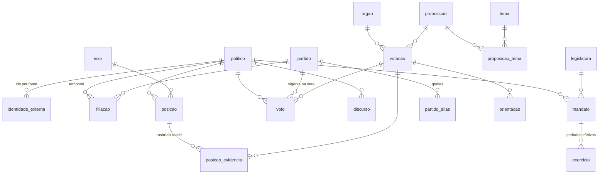

# MODELO-DADOS.md — Fase 0

Schema: [`src/db/schema.ts`](../src/db/schema.ts) (Drizzle + SQLite)
Migration: [`drizzle/`](../drizzle/) — 20 tabelas
Validação: `npm run db:validar` — 17 verificações contra os casos de borda

Referências (§x.y) apontam para [FONTES.md](./FONTES.md).

---

## Princípio de desenho

O modelo não espelha as APIs. Espelha **o que precisa ser verdadeiro para que a
plataforma não minta** — e as APIs, sozinhas, permitem mentir de quatro formas
específicas, todas encontradas no reconhecimento:

| Modelagem ingênua | O que a plataforma exibiria de errado |
|---|---|
| `partido` como coluna de `politico` | 6 dos 31 deputados do RS agrupados na legenda errada (§1.2) |
| Denominador fixo de votações | Todo suplente vira "ausente contumaz" (§1.8) |
| Tratar votação simbólica como nominal | 66% de ruído no cálculo de posição (§1.4) |
| Colapsar `Obstrução` em ausência | Bancadas minoritárias distorcidas (§1.5) |

Cada uma dessas está bloqueada estruturalmente, não por convenção de código.

---

## Diagrama



Três camadas, com fronteira rígida:

1. **Coletado** — espelho fiel da origem (`politico`…`discurso`). Nunca contém
   interpretação.
2. **Derivado** — `posicao`, `posicao_evidencia`. Sempre recalculável a partir da
   camada 1, sempre carimbado com `metodologia_versao`.
3. **Auditoria** — `coleta`. Existe para distinguir "não votou" de "não coletei".

---

## Decisões estruturais

### 1. Identidade separada dos ids de origem

`politico` é a pessoa; `identidade_externa` mapeia para Câmara, Senado e TSE.

Não são colunas `id_camara`/`id_senado` porque o TSE emite um `SQ_CANDIDATO`
**por eleição** — cardinalidade 1:N. E a Fase 4 (estadual/municipal) traz mais
fontes ainda.

**`cpf` é a chave de reconciliação** — validada em 31/31 (§3.4). Normalizado com
zeros à esquerda. É público na origem, mas **não deve sair na API pública nem no
front** (§1.1): mantenha-o fora de qualquer serializer.

### 2. Filiação é linha, não coluna

`filiacao(politico, partido, data_inicio, data_fim)`. `data_fim NULL` = vigente.

Além disso, `voto.partido_id` guarda o partido **na data da votação** — dado que
a Câmara já entrega dentro do próprio registro de voto (§1.5). Isso torna o
cálculo imune a trocas posteriores sem exigir join temporal em toda query.

`partido_alias` existe por um caso concreto: TSE grafa "PC do B", Câmara grafa
"PCdoB". Sem ele, Daiana Santos apareceria como tendo trocado de partido — uma
afirmação falsa sobre uma pessoa real.

### 3. `mandato` e `exercicio` são tabelas diferentes

Um mandato, N períodos de exercício (posse, licença, afastamento, retorno).

É o que corrige o caso Carlos Gomes / Sérgio Turra (§1.8): 0% de participação
não é absenteísmo, é ausência de mandato no período. **O denominador de qualquer
métrica é o nº de votações elegíveis ocorridas dentro dos intervalos de
`exercicio`** — nunca o total do período.

### 4. `votacao.nominal` é derivado e persistido

Não existe campo equivalente na origem: a única forma de saber é chamar `/votos`
e ver se volta vazio (§1.4). Descobrir custa uma requisição; persistir custa um
bit. O índice `votacao_elegivel_idx(nominal, secreta, data)` serve o universo de
cálculo.

`secreta` cobre o Senado, onde 67% das votações não revelam o voto individual
(§2.4).

### 5. Voto normalizado, com original preservado

`voto.voto` é enum normalizado; `voto.tipo_voto_original` guarda o texto exato da
origem. Normalização é interpretação — e interpretação precisa ser auditável
contra o original.

| Normalizado | Origem | Computável |
|---|---|---|
| `sim` / `nao` | Sim / Não | ✅ |
| `abstencao` | Abstenção | ❌ |
| `obstrucao` | Obstrução | ❌ mas **categoria própria** |
| `presidente` | Artigo 17 (Câmara) / art. 51 RISF (Senado) | ❌ |
| `sigiloso` | Votou / P-NRV em votação secreta | ❌ |
| `ausente` | LS, MIS, NCom, NA… | ❌ |

`obstrucao` merece nota: é ato político deliberado, **não** ausência. Colapsá-la
em "faltou" penaliza exatamente as bancadas que a usam como instrumento
regimental. Fica fora do cálculo de posição, mas visível no perfil.

`computavel` é coluna, não expressão em query: a regra fica explícita e
versionável em um lugar só.

### 6. `orientacao` modela a limitação da fonte, não a contorna

`partido_id` só é preenchível quando `tipo_lideranca = 'P'`. Para blocos, a
origem devolve `codPartidoBloco: null` e sigla truncada (`"Bl PlFdrPtUniPp..."`),
e `/blocos/{id}/partidos` retorna vazio (§1.6).

`sigla_bruta` guarda o texto **como veio, truncado e tudo**. Preencher
`partido_id` adivinhando a partir do texto seria criar dado não rastreável —
exatamente o que o princípio do projeto proíbe.

`liberado` distingue liberação de bancada (`orientacaoVoto: ""`) de ausência de
orientação. São coisas diferentes, e liberação é informação política.

### 7. `posicao` separa observações de oportunidades

```
n_oportunidades  → votações elegíveis dentro do exercício do parlamentar
n_observacoes    → em quantas ele registrou voto computável
valor            → a métrica em [0,1]
```

Sem essa separação, suplente com dois meses de mandato é comparado contra o
denominador de quem serviu quatro anos.

### 8. `posicao_evidencia` — o que sustenta o princípio do projeto

Sem ela, a plataforma exibe um número e pede confiança. Com ela, "por que este
político está aqui?" é respondível votação por votação, cada uma com link para a
fonte oficial. `referencia` guarda **contra o que** o voto foi comparado
("Governo", ou a posição majoritária do partido), para que qualquer pessoa refaça
a conta à mão.

Esta é a tabela que traduz "o usuário tira a conclusão" em schema.

### 9. `coleta` — auditoria de ingestão

A API da Câmara deu 504 intermitente durante todo o reconhecimento; uma
requisição precisou de 6 tentativas (§1.9). Sem registro de tentativas e falhas,
**coleta parcial é indistinguível de coleta completa** — e lacuna vira "o
deputado não votou" na interface.

---

## Os dois eixos

Ambos derivam de votação; nenhum usa rótulo atribuído.

### Eixo 1 — alinhamento com o governo federal

```sql
SELECT vt.politico_id,
       SUM(CASE WHEN vt.voto = o.orientacao THEN 1 ELSE 0 END) * 1.0 / COUNT(*) AS valor,
       COUNT(*) AS n_observacoes
FROM voto vt
JOIN votacao v    ON v.id = vt.votacao_id AND v.nominal = 1 AND v.secreta = 0
JOIN orientacao o ON o.votacao_id = v.id AND o.sigla_bruta = 'Governo'
                 AND o.liberado = 0 AND o.orientacao IN ('sim','nao')
WHERE vt.computavel = 1
GROUP BY vt.politico_id;
```

`Governo` e `Oposição` aparecem em 100% das votações nominais medidas (§1.6).

**Rótulo obrigatório:** "alinhamento com o governo federal". Nunca
"esquerda/direita" — mede posição relativa ao executivo do momento, e um partido
troca de lado sem mudar de programa.

### Eixo 2 — coesão com o próprio partido

Não sai de `orientacao`: 11 dos 12 partidos do RS nunca orientam pela própria
sigla (§1.6). Sai dos votos, apurando empiricamente a posição majoritária de cada
partido (§1.6.1) — **excluindo o voto do próprio deputado**, senão ele ajuda a
definir a régua contra a qual está sendo medido:

```sql
WITH cont AS (
  SELECT votacao_id, partido_id,
         SUM(CASE WHEN voto='sim' THEN 1 ELSE 0 END) AS sim,
         SUM(CASE WHEN voto='nao' THEN 1 ELSE 0 END) AS nao
  FROM voto WHERE computavel = 1
  GROUP BY votacao_id, partido_id
)
SELECT vt.politico_id,
       AVG(CASE WHEN vt.voto =
             CASE WHEN (c.sim - (vt.voto='sim')) >= (c.nao - (vt.voto='nao'))
                  THEN 'sim' ELSE 'nao' END
           THEN 1.0 ELSE 0.0 END) AS valor
FROM voto vt
JOIN cont c    ON c.votacao_id = vt.votacao_id AND c.partido_id = vt.partido_id
JOIN votacao v ON v.id = vt.votacao_id AND v.nominal = 1 AND v.secreta = 0
WHERE vt.computavel = 1
GROUP BY vt.politico_id;
```

Medido no 2º tri/2025: 29/31 deputados, amplitude 32,4%–100% (§1.6.1).

**Rótulo obrigatório:** "coesão com o próprio partido". É medida de
comportamento, não de ideologia — dois deputados com 100% em partidos opostos
ocupam o mesmo ponto neste eixo e são politicamente opostos. A visualização
precisa deixar isso óbvio, ou o eixo engana.

---

## Correções impostas pela construção do ingestor

Três ajustes que só apareceram ao rodar o modelo contra dados reais. Estão em
`drizzle/0001` e no schema atual:

**`politico.cpf` passou a ser NULLABLE.** O eixo de coesão compara o parlamentar
com a maioria **nacional** do partido, o que obriga a registrar os votos dos 513
— mas o CPF só existe no endpoint de detalhe, um request por deputado. Exigir
CPF de todos custaria 513 requisições para sustentar 31 perfis.

**`politico.perfil_completo`** distingue quem está no recorte (cadastro,
histórico, discursos) de quem existe apenas como contraparte de voto. Sem a
flag, a interface ofereceria perfil de quem só tem nome e id — lacuna de coleta
parecendo perfil vazio.

**`discurso` deduplica por hash de conteúdo, não por instante.** A chave
`(politico, dataHoraInicio)` descartava 6 discursos reais: um parlamentar
registra falas distintas no mesmo minuto, às vezes com metadados idênticos e
transcrições diferentes. Detalhe em [INGESTOR.md](./INGESTOR.md).

---

## Fora do escopo da Fase 0

Deliberadamente ausentes do schema, para não carregar estrutura sem uso:

- **Despesas parlamentares** (`/deputados/{id}/despesas`) — existe e é rica, mas
  não serve aos dois eixos.
- **Bens declarados / patrimônio** (TSE) — Fase 2+.
- **Tramitações e autoria de proposições** — entram quando houver eixo temático.
- **Notícias de terceiros** — sem fonte oficial por político (§4). Se entrarem,
  vão em tabela própria, marcadas como fonte terceira e visualmente separadas do
  dado oficial.
- **Comissões e frentes parlamentares** — sinal fraco para posicionamento.

`tema` e `proposicao_tema` **estão** no schema mesmo sem uso na Fase 0: os 32
temas oficiais (§1.7) são a base dos eixos temáticos da Fase 2, e o custo de
popular durante a ingestão inicial é próximo de zero — enquanto o custo de
reprocessar todas as votações depois não é.

---

## Próximo passo

Ingestor, na direção `votações → votos → deputados` (§1.3), com retry
obrigatório. Para um ano de plenário: 4 requisições de listagem (janela máxima
de 3 meses) + ~900 de `/votos`. Votações passadas são imutáveis — cache
permanente por `id_externo`; só o período corrente é reprocessado.

Antes de publicar qualquer posição, documentar a metodologia dos dois eixos
(previsto para a Fase 2; antecipado junto com o segundo eixo).
