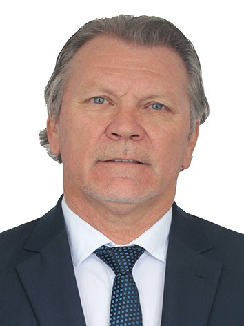
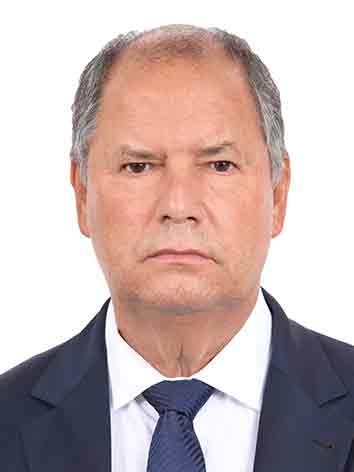
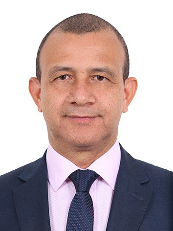
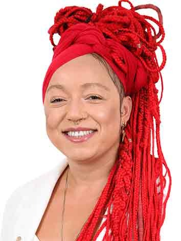
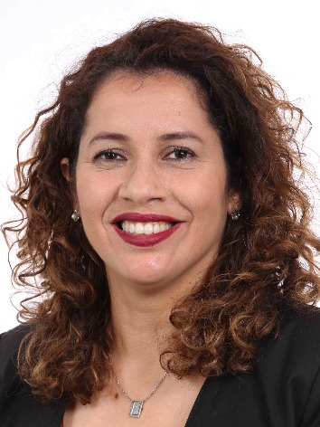
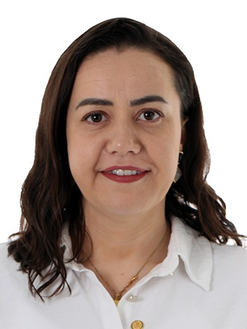
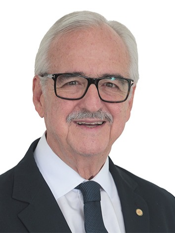
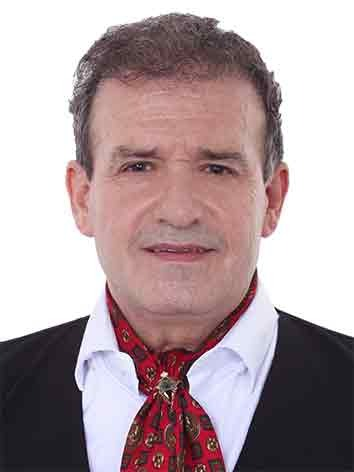
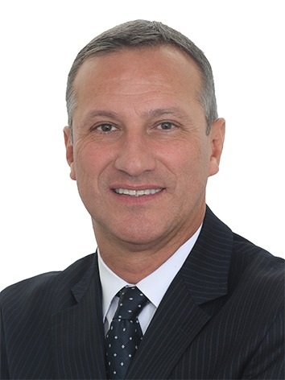

# Deputados federais do Rio Grande do Sul

31 parlamentares da legislatura 57, em ordem alfabética. A ordem é navegação, não classificação.

<svg class="orbita" viewBox="0 0 900 1166" role="img" aria-label="Panorama: alinhamento com o governo federal, no mérito na horizontal, e a órbita de cada parlamentar em torno da maioria do próprio partido. Os mesmos números estão na tabela abaixo.">
<g class="regua">
<line x1="104.0" y1="38" x2="104.0" y2="1154" class="grade"/>
<text x="104.0" y="30" class="tick">0%</text>
<line x1="295.5" y1="38" x2="295.5" y2="1154" class="grade"/>
<text x="295.5" y="30" class="tick">25%</text>
<line x1="487.0" y1="38" x2="487.0" y2="1154" class="grade"/>
<text x="487.0" y="30" class="tick">50%</text>
<line x1="678.5" y1="38" x2="678.5" y2="1154" class="grade"/>
<text x="678.5" y="30" class="tick">75%</text>
<line x1="870.0" y1="38" x2="870.0" y2="1154" class="grade"/>
<text x="870.0" y="30" class="tick">100%</text>
<text x="104" y="20" class="eixo-rot">alinhamento com o governo federal, no mérito →</text>
</g>
<a href="marcio-biolchi/">
<title>Márcio Biolchi (MDB) — alinhamento com o governo federal, no mérito 83,2%, coesão com o próprio partido 90,2%, apurados em 409 votações</title>
<circle cx="741.5" cy="73.0" r="5.8" class="orbe"/>
<circle cx="741.5" cy="73.0" r="2.8" class="corpo"/>
<text x="727.7" y="77.0" text-anchor="end" class="rotulo">Márcio Biolchi</text>
</a>
<a href="alceu-moreira/">
<title>Alceu Moreira (MDB) — alinhamento com o governo federal, no mérito 59,8%, coesão com o próprio partido 75,4%, apurados em 505 votações</title>
<circle cx="562.1" cy="103.0" r="9.4" class="orbe"/>
<circle cx="562.1" cy="103.0" r="2.8" class="corpo"/>
<text x="579.5" y="107.0" text-anchor="start" class="rotulo">Alceu Moreira</text>
</a>
<line x1="90" y1="64" x2="90" y2="112" class="chave"/>
<text x="82" y="92.0" class="sigla-faixa">MDB</text>
<a href="marcel-van-hattem/">
<title>Marcel van Hattem (NOVO) — alinhamento com o governo federal, no mérito 27,7%, coesão com o próprio partido 99,2%, apurados em 513 votações</title>
<circle cx="316.4" cy="147.0" r="3.7" class="orbe"/>
<circle cx="316.4" cy="147.0" r="2.8" class="corpo"/>
<text x="328.0" y="151.0" text-anchor="start" class="rotulo">Marcel van Hattem</text>
</a>
<line x1="90" y1="138" x2="90" y2="156" class="chave"/>
<text x="82" y="151.0" class="sigla-faixa">NOVO</text>
<a href="daiana-santos/">
<title>Daiana Santos (PCdoB) — alinhamento com o governo federal, no mérito 95,1%, coesão com o próprio partido 97,3%, apurados em 442 votações</title>
<circle cx="832.6" cy="191.0" r="4.2" class="orbe"/>
<circle cx="832.6" cy="191.0" r="2.8" class="corpo"/>
<text x="820.4" y="195.0" text-anchor="end" class="rotulo">Daiana Santos</text>
</a>
<line x1="90" y1="182" x2="90" y2="200" class="chave"/>
<text x="82" y="195.0" class="sigla-faixa">PCdoB</text>
<a href="afonso-motta/">
<title>Afonso Motta (PDT) — alinhamento com o governo federal, no mérito 85,7%, coesão com o próprio partido 92,0%, apurados em 485 votações</title>
<circle cx="760.3" cy="235.0" r="5.4" class="orbe"/>
<circle cx="760.3" cy="235.0" r="2.8" class="corpo"/>
<text x="746.9" y="239.0" text-anchor="end" class="rotulo">Afonso Motta</text>
</a>
<a href="pompeo-de-mattos/">
<title>Pompeo de Mattos (PDT) — alinhamento com o governo federal, no mérito 84,5%, coesão com o próprio partido 89,4%, apurados em 463 votações</title>
<circle cx="751.5" cy="265.0" r="6.0" class="orbe"/>
<circle cx="751.5" cy="265.0" r="2.8" class="corpo"/>
<text x="737.5" y="269.0" text-anchor="end" class="rotulo">Pompeo de Mattos</text>
</a>
<line x1="90" y1="226" x2="90" y2="274" class="chave"/>
<text x="82" y="254.0" class="sigla-faixa">PDT</text>
<a href="giovani-cherini/">
<title>Giovani Cherini (PL) — alinhamento com o governo federal, no mérito 33,8%, coesão com o próprio partido 93,4%, apurados em 488 votações</title>
<circle cx="362.6" cy="309.0" r="5.1" class="orbe"/>
<circle cx="362.6" cy="309.0" r="2.8" class="corpo"/>
<text x="375.7" y="313.0" text-anchor="start" class="rotulo">Giovani Cherini</text>
</a>
<a href="bibo-nunes/">
<title>Bibo Nunes (PL) — alinhamento com o governo federal, no mérito 32,7%, coesão com o próprio partido 95,0%, apurados em 521 votações</title>
<circle cx="354.3" cy="339.0" r="4.7" class="orbe"/>
<circle cx="354.3" cy="339.0" r="2.8" class="corpo"/>
<text x="367.0" y="343.0" text-anchor="start" class="rotulo">Bibo Nunes</text>
</a>
<a href="zucco/">
<title>Zucco (PL) — alinhamento com o governo federal, no mérito 31,5%, coesão com o próprio partido 82,8%, apurados em 551 votações</title>
<circle cx="345.1" cy="369.0" r="7.6" class="orbe"/>
<circle cx="345.1" cy="369.0" r="2.8" class="corpo"/>
<text x="360.8" y="373.0" text-anchor="start" class="rotulo">Zucco</text>
</a>
<a href="marcelo-moraes/">
<title>Marcelo Moraes (PL) — alinhamento com o governo federal, no mérito 31,1%, coesão com o próprio partido 94,0%, apurados em 434 votações</title>
<circle cx="342.0" cy="399.0" r="4.9" class="orbe"/>
<circle cx="342.0" cy="399.0" r="2.8" class="corpo"/>
<text x="354.9" y="403.0" text-anchor="start" class="rotulo">Marcelo Moraes</text>
</a>
<a href="osmar-terra/">
<title>Osmar Terra (PL) — alinhamento com o governo federal, no mérito 30,3%, coesão com o próprio partido 63,8%, apurados em 447 votações</title>
<circle cx="335.7" cy="429.0" r="12.2" class="orbe"/>
<circle cx="335.7" cy="429.0" r="2.8" class="corpo"/>
<text x="355.9" y="433.0" text-anchor="start" class="rotulo">Osmar Terra</text>
</a>
<a href="sanderson/">
<title>Sanderson (PL) — alinhamento com o governo federal, no mérito 29,7%, coesão com o próprio partido 93,5%, apurados em 505 votações</title>
<circle cx="331.3" cy="459.0" r="5.1" class="orbe"/>
<circle cx="331.3" cy="459.0" r="2.8" class="corpo"/>
<text x="344.3" y="463.0" text-anchor="start" class="rotulo">Sanderson</text>
</a>
<a href="mauricio-marcon/">
<title>Mauricio Marcon (PL) — alinhamento com o governo federal, no mérito 28,8%, coesão com o próprio partido 51,3%, apurados em 526 votações</title>
<circle cx="325.0" cy="489.0" r="15.2" class="orbe"/>
<circle cx="325.0" cy="489.0" r="2.8" class="corpo"/>
<text x="348.1" y="493.0" text-anchor="start" class="rotulo">Mauricio Marcon</text>
</a>
<line x1="90" y1="300" x2="90" y2="498" class="chave"/>
<text x="82" y="403.0" class="sigla-faixa">PL</text>
<a href="pedro-westphalen/">
<title>Pedro Westphalen (PP) — alinhamento com o governo federal, no mérito 49,9%, coesão com o próprio partido 70,0%, apurados em 493 votações</title>
<circle cx="486.0" cy="533.0" r="10.7" class="orbe"/>
<circle cx="486.0" cy="533.0" r="2.8" class="corpo"/>
<text x="504.7" y="537.0" text-anchor="start" class="rotulo">Pedro Westphalen</text>
</a>
<a href="afonso-hamm/">
<title>Afonso Hamm (PP) — alinhamento com o governo federal, no mérito 49,6%, coesão com o próprio partido 70,2%, apurados em 450 votações</title>
<circle cx="483.7" cy="563.0" r="10.6" class="orbe"/>
<circle cx="483.7" cy="563.0" r="2.8" class="corpo"/>
<text x="502.4" y="567.0" text-anchor="start" class="rotulo">Afonso Hamm</text>
</a>
<a href="covatti-filho/">
<title>Covatti Filho (PP) — alinhamento com o governo federal, no mérito 36,2%, coesão com o próprio partido 57,3%, apurados em 429 votações</title>
<circle cx="381.0" cy="593.0" r="13.7" class="orbe"/>
<circle cx="381.0" cy="593.0" r="2.8" class="corpo"/>
<text x="402.7" y="597.0" text-anchor="start" class="rotulo">Covatti Filho</text>
</a>
<a href="any-ortiz/">
<title>Any Ortiz (PP) — alinhamento com o governo federal, no mérito 35,4%, coesão com o próprio partido 64,0%, apurados em 400 votações</title>
<circle cx="375.3" cy="623.0" r="12.1" class="orbe"/>
<circle cx="375.3" cy="623.0" r="2.8" class="corpo"/>
<text x="395.4" y="627.0" text-anchor="start" class="rotulo">Any Ortiz</text>
</a>
<line x1="90" y1="524" x2="90" y2="632" class="chave"/>
<text x="82" y="582.0" class="sigla-faixa">PP</text>
<a href="heitor-schuch/">
<title>Heitor Schuch (PSD) — alinhamento com o governo federal, no mérito 88,1%, coesão com o próprio partido 92,7%, apurados em 330 votações</title>
<circle cx="778.7" cy="667.0" r="5.2" class="orbe"/>
<circle cx="778.7" cy="667.0" r="2.8" class="corpo"/>
<text x="765.5" y="671.0" text-anchor="end" class="rotulo">Heitor Schuch</text>
</a>
<a href="danrlei-de-deus-hinterholz/">
<title>Danrlei de Deus Hinterholz (PSD) — alinhamento com o governo federal, no mérito 53,0%, coesão com o próprio partido 70,4%, apurados em 240 votações</title>
<circle cx="509.8" cy="697.0" r="10.6" class="orbe"/>
<circle cx="509.8" cy="697.0" r="2.8" class="corpo"/>
<text x="528.4" y="701.0" text-anchor="start" class="rotulo">Danrlei de Deus Hinterholz</text>
</a>
<a href="lucas-redecker/">
<title>Lucas Redecker (PSD) — alinhamento com o governo federal, no mérito 42,4%, coesão com o próprio partido 64,3%, apurados em 540 votações</title>
<circle cx="428.7" cy="727.0" r="12.1" class="orbe"/>
<circle cx="428.7" cy="727.0" r="2.8" class="corpo"/>
<text x="448.8" y="731.0" text-anchor="start" class="rotulo">Lucas Redecker</text>
</a>
<line x1="90" y1="658" x2="90" y2="736" class="chave"/>
<text x="82" y="701.0" class="sigla-faixa">PSD</text>
<a href="daniel-trzeciak/">
<title>Daniel Trzeciak (PSDB) — alinhamento com o governo federal, no mérito 49,1%, coesão com o próprio partido 72,3%, apurados em 488 votações</title>
<circle cx="480.2" cy="771.0" r="10.1" class="orbe"/>
<circle cx="480.2" cy="771.0" r="2.8" class="corpo"/>
<text x="498.4" y="775.0" text-anchor="start" class="rotulo">Daniel Trzeciak</text>
</a>
<line x1="90" y1="762" x2="90" y2="780" class="chave"/>
<text x="82" y="775.0" class="sigla-faixa">PSDB</text>
<a href="fernanda-melchionna/">
<title>Fernanda Melchionna (PSOL) — alinhamento com o governo federal, no mérito 83,1%, coesão com o próprio partido 98,0%, apurados em 458 votações</title>
<circle cx="740.2" cy="815.0" r="4.0" class="orbe"/>
<circle cx="740.2" cy="815.0" r="2.8" class="corpo"/>
<text x="728.2" y="819.0" text-anchor="end" class="rotulo">Fernanda Melchionna</text>
</a>
<line x1="90" y1="806" x2="90" y2="824" class="chave"/>
<text x="82" y="819.0" class="sigla-faixa">PSOL</text>
<a href="bohn-gass/">
<title>Bohn Gass (PT) — alinhamento com o governo federal, no mérito 97,3%, coesão com o próprio partido 97,9%, apurados em 524 votações</title>
<circle cx="849.4" cy="859.0" r="4.0" class="orbe"/>
<circle cx="849.4" cy="859.0" r="2.8" class="corpo"/>
<text x="837.4" y="863.0" text-anchor="end" class="rotulo">Bohn Gass</text>
</a>
<a href="paulo-pimenta/">
<title>Paulo Pimenta (PT) — alinhamento com o governo federal, no mérito 97,1%, coesão com o próprio partido 98,0%, apurados em 251 votações</title>
<circle cx="847.6" cy="889.0" r="4.0" class="orbe"/>
<circle cx="847.6" cy="889.0" r="2.8" class="corpo"/>
<text x="835.6" y="893.0" text-anchor="end" class="rotulo">Paulo Pimenta</text>
</a>
<a href="denise-pessoa/">
<title>Denise Pessôa (PT) — alinhamento com o governo federal, no mérito 96,0%, coesão com o próprio partido 97,1%, apurados em 514 votações</title>
<circle cx="839.6" cy="919.0" r="4.2" class="orbe"/>
<circle cx="839.6" cy="919.0" r="2.8" class="corpo"/>
<text x="827.4" y="923.0" text-anchor="end" class="rotulo">Denise Pessôa</text>
</a>
<a href="alexandre-lindenmeyer/">
<title>Alexandre Lindenmeyer (PT) — alinhamento com o governo federal, no mérito 95,8%, coesão com o próprio partido 96,4%, apurados em 469 votações</title>
<circle cx="837.6" cy="949.0" r="4.4" class="orbe"/>
<circle cx="837.6" cy="949.0" r="2.8" class="corpo"/>
<text x="825.2" y="953.0" text-anchor="end" class="rotulo">Alexandre Lindenmeyer</text>
</a>
<a href="maria-do-rosario/">
<title>Maria do Rosário (PT) — alinhamento com o governo federal, no mérito 95,1%, coesão com o próprio partido 96,8%, apurados em 431 votações</title>
<circle cx="832.4" cy="979.0" r="4.3" class="orbe"/>
<circle cx="832.4" cy="979.0" r="2.8" class="corpo"/>
<text x="820.1" y="983.0" text-anchor="end" class="rotulo">Maria do Rosário</text>
</a>
<a href="marcon/">
<title>Marcon (PT) — alinhamento com o governo federal, no mérito 94,5%, coesão com o próprio partido 95,6%, apurados em 496 votações</title>
<circle cx="828.0" cy="1009.0" r="4.6" class="orbe"/>
<circle cx="828.0" cy="1009.0" r="2.8" class="corpo"/>
<text x="815.4" y="1013.0" text-anchor="end" class="rotulo">Marcon</text>
</a>
<line x1="90" y1="850" x2="90" y2="1018" class="chave"/>
<text x="82" y="938.0" class="sigla-faixa">PT</text>
<a href="carlos-gomes/">
<title>Carlos Gomes (REPUBLICANOS) — alinhamento com o governo federal, no mérito 85,3%, coesão com o próprio partido 97,6%, apurados em 126 votações</title>
<circle cx="757.4" cy="1053.0" r="4.1" class="orbe"/>
<circle cx="757.4" cy="1053.0" r="2.8" class="corpo"/>
<text x="745.3" y="1057.0" text-anchor="end" class="rotulo">Carlos Gomes</text>
</a>
<a href="franciane-bayer/">
<title>Franciane Bayer (REPUBLICANOS) — alinhamento com o governo federal, no mérito 57,8%, coesão com o próprio partido 80,0%, apurados em 509 votações</title>
<circle cx="547.0" cy="1083.0" r="8.3" class="orbe"/>
<circle cx="547.0" cy="1083.0" r="2.8" class="corpo"/>
<text x="563.3" y="1087.0" text-anchor="start" class="rotulo">Franciane Bayer</text>
</a>
<line x1="90" y1="1044" x2="90" y2="1092" class="chave"/>
<text x="82" y="1072.0" class="sigla-faixa">REPUBLICANOS</text>
<a href="luiz-carlos-busato/">
<title>Luiz Carlos Busato (UNIÃO) — alinhamento com o governo federal, no mérito 77,2%, coesão com o próprio partido 91,9%, apurados em 495 votações</title>
<circle cx="695.5" cy="1127.0" r="5.4" class="orbe"/>
<circle cx="695.5" cy="1127.0" r="2.8" class="corpo"/>
<text x="682.0" y="1131.0" text-anchor="end" class="rotulo">Luiz Carlos Busato</text>
</a>
<line x1="90" y1="1118" x2="90" y2="1136" class="chave"/>
<text x="82" y="1131.0" class="sigla-faixa">UNIÃO</text>
</svg>

O panorama acima rola para o lado — ou role a
página até a tabela, que traz os mesmos números em texto.

**Como ler.** Cada corpo é um parlamentar; a posição horizontal é o
alinhamento com o governo, e essa comparação vale entre todos, porque a
referência é a mesma — a orientação declarada do Governo. **A órbita ao
redor é outra coisa**: mede o quanto o voto se afasta da maioria da
própria bancada. Órbita pequena é quem quase nunca destoa dos seus.

> **Por isso cada partido tem sua faixa.** Coesão só significa alguma
> coisa dentro da mesma legenda: a referência dela é a maioria daquele
> partido, e são maiorias diferentes. Marcel van Hattem tem 99% de coesão
> com o NOVO e Bohn Gass tem 98% com o PT — órbitas quase idênticas, e
> política oposta. Num gráfico que pusesse coesão num eixo, os dois
> ficariam colados, e a proximidade diria algo falso sem que ninguém
> tivesse escrito uma frase falsa.

**O gráfico não mostra o `n`**, e nenhum ponto deve ser lido sem
ele: os denominadores vão de **126 a 551
votações**, porque cada parlamentar é medido só no seu período de
exercício. O `n` de cada um está na tabela abaixo e no perfil — e
aparece ao passar o cursor sobre o corpo, que é acréscimo, não
substituto.

> **Estas duas colunas não se comparam entre si e não ordenam ninguém.**
> Alinhamento mede coincidência com a orientação declarada pela liderança do
> Governo; coesão mede coincidência com a maioria do próprio partido. Um
> valor alto não é melhor que um baixo — é outro. E os dois só significam
> alguma coisa ao lado do `n`: o número de votações de que foram extraídos.

| Parlamentar | Partido | Alinh. c/ governo | Coesão partidária | Votações (n) |
|---|---|---:|---:|---:|
| [Afonso Hamm](afonso-hamm/) | PP | 49,6% | 70,2% | n&nbsp;=&nbsp;<b>353</b> |
| [Afonso Motta](afonso-motta/) | PDT | 85,7% | 92,0% | n&nbsp;=&nbsp;<b>391</b> |
| [Alceu Moreira](alceu-moreira/) | MDB | 59,8% | 75,4% | n&nbsp;=&nbsp;<b>408</b> |
| [Alexandre Lindenmeyer](alexandre-lindenmeyer/) | PT | 95,8% | 96,4% | n&nbsp;=&nbsp;<b>378</b> |
| [Any Ortiz](any-ortiz/) | PP | 35,4% | 64,0% | n&nbsp;=&nbsp;<b>384</b> |
| [Bibo Nunes](bibo-nunes/) | PL | 32,7% | 95,0% | n&nbsp;=&nbsp;<b>404</b> |
| [Bohn Gass](bohn-gass/) | PT | 97,3% | 97,9% | n&nbsp;=&nbsp;<b>410</b> |
| [Carlos Gomes](carlos-gomes/) | REPUBLICANOS | 85,3% | 97,6% | n&nbsp;=&nbsp;<b>102</b> |
| [Covatti Filho](covatti-filho/) | PP | 36,2% | 57,3% | n&nbsp;=&nbsp;<b>354</b> |
| [Daiana Santos](daiana-santos/) | PCdoB | 95,1% | 97,3% | n&nbsp;=&nbsp;<b>348</b> |
| [Daniel Trzeciak](daniel-trzeciak/) | PSDB | 49,1% | 72,3% | n&nbsp;=&nbsp;<b>395</b> |
| [Danrlei de Deus Hinterholz](danrlei-de-deus-hinterholz/) | PSD | 53,0% | 70,4% | n&nbsp;=&nbsp;<b>185</b> |
| [Denise Pessôa](denise-pessoa/) | PT | 96,0% | 97,1% | n&nbsp;=&nbsp;<b>403</b> |
| [Fernanda Melchionna](fernanda-melchionna/) | PSOL | 83,1% | 98,0% | n&nbsp;=&nbsp;<b>360</b> |
| [Franciane Bayer](franciane-bayer/) | REPUBLICANOS | 57,8% | 80,0% | n&nbsp;=&nbsp;<b>396</b> |
| [Giovani Cherini](giovani-cherini/) | PL | 33,8% | 93,4% | n&nbsp;=&nbsp;<b>385</b> |
| [Heitor Schuch](heitor-schuch/) | PSD | 88,1% | 92,7% | n&nbsp;=&nbsp;<b>277</b> |
| [Lucas Redecker](lucas-redecker/) | PSD | 42,4% | 64,3% | n&nbsp;=&nbsp;<b>427</b> |
| [Luiz Carlos Busato](luiz-carlos-busato/) | UNIÃO | 77,2% | 91,9% | n&nbsp;=&nbsp;<b>395</b> |
| [Marcel van Hattem](marcel-van-hattem/) | NOVO | 27,7% | 99,2% | n&nbsp;=&nbsp;<b>404</b> |
| [Marcelo Moraes](marcelo-moraes/) | PL | 31,1% | 94,0% | n&nbsp;=&nbsp;<b>338</b> |
| [Marcon](marcon/) | PT | 94,5% | 95,6% | n&nbsp;=&nbsp;<b>401</b> |
| [Maria do Rosário](maria-do-rosario/) | PT | 95,1% | 96,8% | n&nbsp;=&nbsp;<b>346</b> |
| [Mauricio Marcon](mauricio-marcon/) | PL | 28,8% | 51,3% | n&nbsp;=&nbsp;<b>416</b> |
| [Márcio Biolchi](marcio-biolchi/) | MDB | 83,2% | 90,2% | n&nbsp;=&nbsp;<b>316</b> |
| [Osmar Terra](osmar-terra/) | PL | 30,3% | 63,8% | n&nbsp;=&nbsp;<b>357</b> |
| [Paulo Pimenta](paulo-pimenta/) | PT | 97,1% | 98,0% | n&nbsp;=&nbsp;<b>205</b> |
| [Pedro Westphalen](pedro-westphalen/) | PP | 49,9% | 70,0% | n&nbsp;=&nbsp;<b>383</b> |
| [Pompeo de Mattos](pompeo-de-mattos/) | PDT | 84,5% | 89,4% | n&nbsp;=&nbsp;<b>375</b> |
| [Sanderson](sanderson/) | PL | 29,7% | 93,5% | n&nbsp;=&nbsp;<b>391</b> |
| [Zucco](zucco/) | PL | 31,5% | 82,8% | n&nbsp;=&nbsp;<b>432</b> |
{: .t-indice}

Valores do escopo de **mérito** — o principal. Cada perfil traz também o
escopo procedimental e os recortes por tema.
