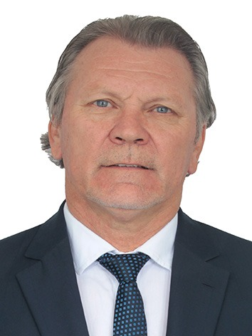
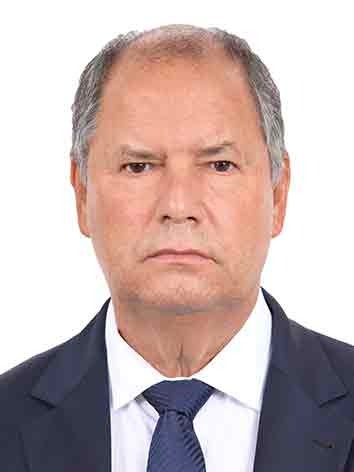
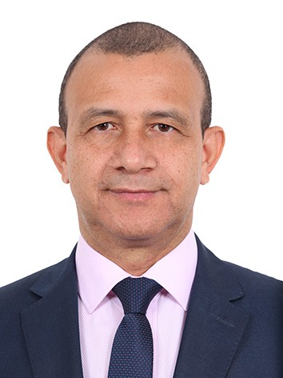
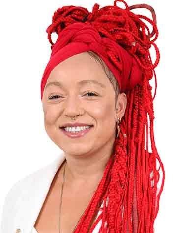
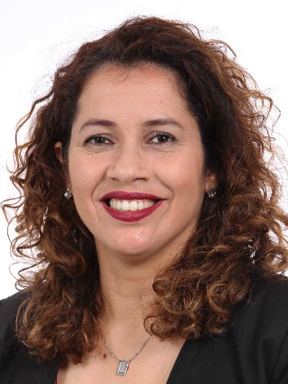
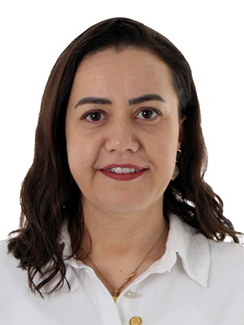
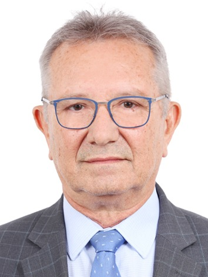
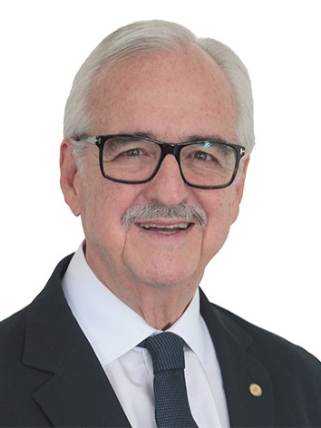
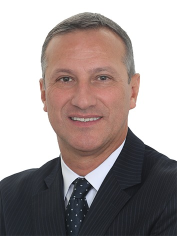

# Deputados federais do Rio Grande do Sul

31 parlamentares da legislatura 57, em ordem alfabética. A ordem é navegação, não classificação.

<svg class="orbita" viewBox="0 0 900 1180" role="img" aria-label="Panorama: alinhamento com o governo federal, no mérito na horizontal, e a órbita de cada parlamentar em torno da maioria do próprio partido. Os mesmos números estão na tabela abaixo.">
<g class="regua">
<line x1="104.0" y1="54" x2="104.0" y2="1168" class="grade"/>
<text x="104.0" y="46" class="tick">0%</text>
<line x1="295.5" y1="54" x2="295.5" y2="1168" class="grade"/>
<text x="295.5" y="46" class="tick">25%</text>
<line x1="487.0" y1="54" x2="487.0" y2="1168" class="grade"/>
<text x="487.0" y="46" class="tick">50%</text>
<line x1="678.5" y1="54" x2="678.5" y2="1168" class="grade"/>
<text x="678.5" y="46" class="tick">75%</text>
<line x1="870.0" y1="54" x2="870.0" y2="1168" class="grade"/>
<text x="870.0" y="46" class="tick">100%</text>
<text x="104" y="18" class="eixo-rot">alinhamento com o governo federal, no mérito →</text>
</g>
<a href="marcio-biolchi/">
<title>Márcio Biolchi (MDB) — alinhamento com o governo federal, no mérito 83,2%, coesão com o próprio partido 90,2%, apurados em 409 votações</title>
<circle cx="741.5" cy="87.0" r="5.8" class="orbe"/>
<circle cx="741.5" cy="87.0" r="2.8" class="corpo"/>
<text x="727.7" y="91.0" text-anchor="end" class="rotulo">Márcio Biolchi</text>
</a>
<a href="alceu-moreira/">
<title>Alceu Moreira (MDB) — alinhamento com o governo federal, no mérito 59,8%, coesão com o próprio partido 75,5%, apurados em 507 votações</title>
<circle cx="561.7" cy="117.0" r="9.4" class="orbe"/>
<circle cx="561.7" cy="117.0" r="2.8" class="corpo"/>
<text x="579.1" y="121.0" text-anchor="start" class="rotulo">Alceu Moreira</text>
</a>
<line x1="90" y1="78" x2="90" y2="126" class="chave"/>
<text x="82" y="106.0" class="sigla-faixa">MDB</text>
<a href="marcel-van-hattem/">
<title>Marcel van Hattem (NOVO) — alinhamento com o governo federal, no mérito 27,8%, coesão com o próprio partido 99,2%, apurados em 515 votações</title>
<circle cx="317.2" cy="161.0" r="3.7" class="orbe"/>
<circle cx="317.2" cy="161.0" r="2.8" class="corpo"/>
<text x="328.9" y="165.0" text-anchor="start" class="rotulo">Marcel van Hattem</text>
</a>
<line x1="90" y1="152" x2="90" y2="170" class="chave"/>
<text x="82" y="165.0" class="sigla-faixa">NOVO</text>
<a href="daiana-santos/">
<title>Daiana Santos (PCdoB) — alinhamento com o governo federal, no mérito 95,1%, coesão com o próprio partido 97,3%, apurados em 444 votações</title>
<circle cx="832.8" cy="205.0" r="4.1" class="orbe"/>
<circle cx="832.8" cy="205.0" r="2.8" class="corpo"/>
<text x="820.6" y="209.0" text-anchor="end" class="rotulo">Daiana Santos</text>
</a>
<line x1="90" y1="196" x2="90" y2="214" class="chave"/>
<text x="82" y="209.0" class="sigla-faixa">PCdoB</text>
<a href="afonso-motta/">
<title>Afonso Motta (PDT) — alinhamento com o governo federal, no mérito 85,5%, coesão com o próprio partido 91,8%, apurados em 487 votações</title>
<circle cx="758.9" cy="249.0" r="5.5" class="orbe"/>
<circle cx="758.9" cy="249.0" r="2.8" class="corpo"/>
<text x="745.4" y="253.0" text-anchor="end" class="rotulo">Afonso Motta</text>
</a>
<a href="pompeo-de-mattos/">
<title>Pompeo de Mattos (PDT) — alinhamento com o governo federal, no mérito 84,6%, coesão com o próprio partido 89,5%, apurados em 465 votações</title>
<circle cx="752.2" cy="279.0" r="6.0" class="orbe"/>
<circle cx="752.2" cy="279.0" r="2.8" class="corpo"/>
<text x="738.1" y="283.0" text-anchor="end" class="rotulo">Pompeo de Mattos</text>
</a>
<line x1="90" y1="240" x2="90" y2="288" class="chave"/>
<text x="82" y="268.0" class="sigla-faixa">PDT</text>
<a href="giovani-cherini/">
<title>Giovani Cherini (PL) — alinhamento com o governo federal, no mérito 33,9%, coesão com o próprio partido 93,5%, apurados em 490 votações</title>
<circle cx="363.3" cy="323.0" r="5.1" class="orbe"/>
<circle cx="363.3" cy="323.0" r="2.8" class="corpo"/>
<text x="376.4" y="327.0" text-anchor="start" class="rotulo">Giovani Cherini</text>
</a>
<a href="bibo-nunes/">
<title>Bibo Nunes (PL) — alinhamento com o governo federal, no mérito 32,8%, coesão com o próprio partido 95,0%, apurados em 523 votações</title>
<circle cx="354.9" cy="353.0" r="4.7" class="orbe"/>
<circle cx="354.9" cy="353.0" r="2.8" class="corpo"/>
<text x="367.6" y="357.0" text-anchor="start" class="rotulo">Bibo Nunes</text>
</a>
<a href="zucco/">
<title>Zucco (PL) — alinhamento com o governo federal, no mérito 31,6%, coesão com o próprio partido 82,8%, apurados em 553 votações</title>
<circle cx="345.8" cy="383.0" r="7.6" class="orbe"/>
<circle cx="345.8" cy="383.0" r="2.8" class="corpo"/>
<text x="361.4" y="387.0" text-anchor="start" class="rotulo">Zucco</text>
</a>
<a href="marcelo-moraes/">
<title>Marcelo Moraes (PL) — alinhamento com o governo federal, no mérito 31,3%, coesão com o próprio partido 94,0%, apurados em 435 votações</title>
<circle cx="343.5" cy="413.0" r="4.9" class="orbe"/>
<circle cx="343.5" cy="413.0" r="2.8" class="corpo"/>
<text x="356.5" y="417.0" text-anchor="start" class="rotulo">Marcelo Moraes</text>
</a>
<a href="osmar-terra/">
<title>Osmar Terra (PL) — alinhamento com o governo federal, no mérito 30,4%, coesão com o próprio partido 63,9%, apurados em 449 votações</title>
<circle cx="336.6" cy="443.0" r="12.2" class="orbe"/>
<circle cx="336.6" cy="443.0" r="2.8" class="corpo"/>
<text x="356.7" y="447.0" text-anchor="start" class="rotulo">Osmar Terra</text>
</a>
<a href="sanderson/">
<title>Sanderson (PL) — alinhamento com o governo federal, no mérito 29,8%, coesão com o próprio partido 93,5%, apurados em 507 votações</title>
<circle cx="332.0" cy="473.0" r="5.1" class="orbe"/>
<circle cx="332.0" cy="473.0" r="2.8" class="corpo"/>
<text x="345.1" y="477.0" text-anchor="start" class="rotulo">Sanderson</text>
</a>
<a href="mauricio-marcon/">
<title>Mauricio Marcon (PL) — alinhamento com o governo federal, no mérito 28,9%, coesão com o próprio partido 51,5%, apurados em 528 votações</title>
<circle cx="325.7" cy="503.0" r="15.1" class="orbe"/>
<circle cx="325.7" cy="503.0" r="2.8" class="corpo"/>
<text x="348.9" y="507.0" text-anchor="start" class="rotulo">Mauricio Marcon</text>
</a>
<line x1="90" y1="314" x2="90" y2="512" class="chave"/>
<text x="82" y="417.0" class="sigla-faixa">PL</text>
<a href="pedro-westphalen/">
<title>Pedro Westphalen (PP) — alinhamento com o governo federal, no mérito 49,9%, coesão com o próprio partido 70,1%, apurados em 495 votações</title>
<circle cx="486.0" cy="547.0" r="10.7" class="orbe"/>
<circle cx="486.0" cy="547.0" r="2.8" class="corpo"/>
<text x="504.7" y="551.0" text-anchor="start" class="rotulo">Pedro Westphalen</text>
</a>
<a href="afonso-hamm/">
<title>Afonso Hamm (PP) — alinhamento com o governo federal, no mérito 49,4%, coesão com o próprio partido 70,3%, apurados em 451 votações</title>
<circle cx="482.7" cy="577.0" r="10.6" class="orbe"/>
<circle cx="482.7" cy="577.0" r="2.8" class="corpo"/>
<text x="501.3" y="581.0" text-anchor="start" class="rotulo">Afonso Hamm</text>
</a>
<a href="covatti-filho/">
<title>Covatti Filho (PP) — alinhamento com o governo federal, no mérito 36,2%, coesão com o próprio partido 57,5%, apurados em 431 votações</title>
<circle cx="381.6" cy="607.0" r="13.7" class="orbe"/>
<circle cx="381.6" cy="607.0" r="2.8" class="corpo"/>
<text x="403.3" y="611.0" text-anchor="start" class="rotulo">Covatti Filho</text>
</a>
<a href="any-ortiz/">
<title>Any Ortiz (PP) — alinhamento com o governo federal, no mérito 35,5%, coesão com o próprio partido 64,2%, apurados em 402 votações</title>
<circle cx="375.9" cy="637.0" r="12.1" class="orbe"/>
<circle cx="375.9" cy="637.0" r="2.8" class="corpo"/>
<text x="396.0" y="641.0" text-anchor="start" class="rotulo">Any Ortiz</text>
</a>
<line x1="90" y1="538" x2="90" y2="646" class="chave"/>
<text x="82" y="596.0" class="sigla-faixa">PP</text>
<a href="heitor-schuch/">
<title>Heitor Schuch (PSD) — alinhamento com o governo federal, no mérito 87,8%, coesão com o próprio partido 92,8%, apurados em 332 votações</title>
<circle cx="776.7" cy="681.0" r="5.2" class="orbe"/>
<circle cx="776.7" cy="681.0" r="2.8" class="corpo"/>
<text x="763.4" y="685.0" text-anchor="end" class="rotulo">Heitor Schuch</text>
</a>
<a href="danrlei-de-deus-hinterholz/">
<title>Danrlei de Deus Hinterholz (PSD) — alinhamento com o governo federal, no mérito 53,0%, coesão com o próprio partido 70,4%, apurados em 240 votações</title>
<circle cx="509.8" cy="711.0" r="10.6" class="orbe"/>
<circle cx="509.8" cy="711.0" r="2.8" class="corpo"/>
<text x="528.4" y="715.0" text-anchor="start" class="rotulo">Danrlei de Deus Hinterholz</text>
</a>
<a href="lucas-redecker/">
<title>Lucas Redecker (PSD) — alinhamento com o governo federal, no mérito 42,4%, coesão com o próprio partido 64,4%, apurados em 542 votações</title>
<circle cx="429.0" cy="741.0" r="12.0" class="orbe"/>
<circle cx="429.0" cy="741.0" r="2.8" class="corpo"/>
<text x="449.0" y="745.0" text-anchor="start" class="rotulo">Lucas Redecker</text>
</a>
<line x1="90" y1="672" x2="90" y2="750" class="chave"/>
<text x="82" y="715.0" class="sigla-faixa">PSD</text>
<a href="daniel-trzeciak/">
<title>Daniel Trzeciak (PSDB) — alinhamento com o governo federal, no mérito 49,1%, coesão com o próprio partido 72,4%, apurados em 490 votações</title>
<circle cx="480.2" cy="785.0" r="10.1" class="orbe"/>
<circle cx="480.2" cy="785.0" r="2.8" class="corpo"/>
<text x="498.4" y="789.0" text-anchor="start" class="rotulo">Daniel Trzeciak</text>
</a>
<line x1="90" y1="776" x2="90" y2="794" class="chave"/>
<text x="82" y="789.0" class="sigla-faixa">PSDB</text>
<a href="fernanda-melchionna/">
<title>Fernanda Melchionna (PSOL) — alinhamento com o governo federal, no mérito 83,1%, coesão com o próprio partido 98,0%, apurados em 460 votações</title>
<circle cx="740.9" cy="829.0" r="4.0" class="orbe"/>
<circle cx="740.9" cy="829.0" r="2.8" class="corpo"/>
<text x="729.0" y="833.0" text-anchor="end" class="rotulo">Fernanda Melchionna</text>
</a>
<line x1="90" y1="820" x2="90" y2="838" class="chave"/>
<text x="82" y="833.0" class="sigla-faixa">PSOL</text>
<a href="bohn-gass/">
<title>Bohn Gass (PT) — alinhamento com o governo federal, no mérito 97,3%, coesão com o próprio partido 97,9%, apurados em 526 votações</title>
<circle cx="849.5" cy="873.0" r="4.0" class="orbe"/>
<circle cx="849.5" cy="873.0" r="2.8" class="corpo"/>
<text x="837.5" y="877.0" text-anchor="end" class="rotulo">Bohn Gass</text>
</a>
<a href="paulo-pimenta/">
<title>Paulo Pimenta (PT) — alinhamento com o governo federal, no mérito 97,1%, coesão com o próprio partido 98,0%, apurados em 253 votações</title>
<circle cx="847.8" cy="903.0" r="4.0" class="orbe"/>
<circle cx="847.8" cy="903.0" r="2.8" class="corpo"/>
<text x="835.8" y="907.0" text-anchor="end" class="rotulo">Paulo Pimenta</text>
</a>
<a href="denise-pessoa/">
<title>Denise Pessôa (PT) — alinhamento com o governo federal, no mérito 96,0%, coesão com o próprio partido 97,1%, apurados em 516 votações</title>
<circle cx="839.7" cy="933.0" r="4.2" class="orbe"/>
<circle cx="839.7" cy="933.0" r="2.8" class="corpo"/>
<text x="827.5" y="937.0" text-anchor="end" class="rotulo">Denise Pessôa</text>
</a>
<a href="alexandre-lindenmeyer/">
<title>Alexandre Lindenmeyer (PT) — alinhamento com o governo federal, no mérito 95,8%, coesão com o próprio partido 96,4%, apurados em 471 votações</title>
<circle cx="837.7" cy="963.0" r="4.4" class="orbe"/>
<circle cx="837.7" cy="963.0" r="2.8" class="corpo"/>
<text x="825.4" y="967.0" text-anchor="end" class="rotulo">Alexandre Lindenmeyer</text>
</a>
<a href="maria-do-rosario/">
<title>Maria do Rosário (PT) — alinhamento com o governo federal, no mérito 95,1%, coesão com o próprio partido 96,8%, apurados em 433 votações</title>
<circle cx="832.6" cy="993.0" r="4.3" class="orbe"/>
<circle cx="832.6" cy="993.0" r="2.8" class="corpo"/>
<text x="820.3" y="997.0" text-anchor="end" class="rotulo">Maria do Rosário</text>
</a>
<a href="marcon/">
<title>Marcon (PT) — alinhamento com o governo federal, no mérito 94,5%, coesão com o próprio partido 95,6%, apurados em 498 votações</title>
<circle cx="828.2" cy="1023.0" r="4.6" class="orbe"/>
<circle cx="828.2" cy="1023.0" r="2.8" class="corpo"/>
<text x="815.6" y="1027.0" text-anchor="end" class="rotulo">Marcon</text>
</a>
<line x1="90" y1="864" x2="90" y2="1032" class="chave"/>
<text x="82" y="952.0" class="sigla-faixa">PT</text>
<a href="carlos-gomes/">
<title>Carlos Gomes (REPUBLICANOS) — alinhamento com o governo federal, no mérito 84,6%, coesão com o próprio partido 97,7%, apurados em 128 votações</title>
<circle cx="752.2" cy="1067.0" r="4.1" class="orbe"/>
<circle cx="752.2" cy="1067.0" r="2.8" class="corpo"/>
<text x="740.1" y="1071.0" text-anchor="end" class="rotulo">Carlos Gomes</text>
</a>
<a href="franciane-bayer/">
<title>Franciane Bayer (REPUBLICANOS) — alinhamento com o governo federal, no mérito 57,8%, coesão com o próprio partido 80,0%, apurados em 511 votações</title>
<circle cx="546.7" cy="1097.0" r="8.3" class="orbe"/>
<circle cx="546.7" cy="1097.0" r="2.8" class="corpo"/>
<text x="563.0" y="1101.0" text-anchor="start" class="rotulo">Franciane Bayer</text>
</a>
<line x1="90" y1="1058" x2="90" y2="1106" class="chave"/>
<text x="82" y="1086.0" class="sigla-faixa">REPUBLICANOS</text>
<a href="luiz-carlos-busato/">
<title>Luiz Carlos Busato (UNIÃO) — alinhamento com o governo federal, no mérito 77,1%, coesão com o próprio partido 91,8%, apurados em 497 votações</title>
<circle cx="694.4" cy="1141.0" r="5.5" class="orbe"/>
<circle cx="694.4" cy="1141.0" r="2.8" class="corpo"/>
<text x="680.9" y="1145.0" text-anchor="end" class="rotulo">Luiz Carlos Busato</text>
</a>
<line x1="90" y1="1132" x2="90" y2="1150" class="chave"/>
<text x="82" y="1145.0" class="sigla-faixa">UNIÃO</text>
</svg>

O panorama acima rola para o lado — ou role a
página até a tabela, que traz os mesmos números em texto.

<b>Como ler.</b> Cada corpo é um parlamentar; a posição horizontal é o alinhamento com o governo, e essa comparação vale entre todos, porque a referência é a mesma — a orientação declarada do Governo. <b>A órbita ao redor é outra coisa</b>: mede o quanto o voto se afasta da maioria da própria bancada. Órbita pequena é quem quase nunca destoa dos seus.

<b>O gráfico não mostra o <code>n</code></b>, e nenhum ponto deve ser lido sem ele: os denominadores vão de <b>128 a 553 votações</b>, porque cada parlamentar é medido só no seu período de exercício. O <code>n</code> de cada um está na tabela abaixo e no perfil — e aparece ao passar o cursor sobre o corpo, que é acréscimo, não substituto.

<b>Por isso cada partido tem sua faixa.</b> Coesão só significa alguma coisa dentro da mesma legenda: a referência dela é a maioria daquele partido, e são maiorias diferentes. Marcel van Hattem tem 99% de coesão com o NOVO e Bohn Gass tem 98% com o PT — órbitas quase idênticas, e política oposta. Num gráfico que pusesse coesão num eixo, os dois ficariam colados, e a proximidade diria algo falso sem que ninguém tivesse escrito uma frase falsa.

<b>Estas duas colunas não se comparam entre si e não ordenam ninguém.</b> Alinhamento mede coincidência com a orientação declarada pela liderança do Governo; coesão mede coincidência com a maioria do próprio partido. Um valor alto não é melhor que um baixo — é outro. E os dois só significam alguma coisa ao lado do <code>n</code>: o número de votações de que foram extraídos.

| Parlamentar | Partido | Alinh. c/ governo | Coesão partidária | Votações (n) |
|---|---|---:|---:|---:|
| [Afonso Hamm](afonso-hamm/) | PP | 49,4% | 70,3% | n&nbsp;=&nbsp;<b>354</b> |
| [Afonso Motta](afonso-motta/) | PDT | 85,5% | 91,8% | n&nbsp;=&nbsp;<b>393</b> |
| [Alceu Moreira](alceu-moreira/) | MDB | 59,8% | 75,5% | n&nbsp;=&nbsp;<b>410</b> |
| [Alexandre Lindenmeyer](alexandre-lindenmeyer/) | PT | 95,8% | 96,4% | n&nbsp;=&nbsp;<b>380</b> |
| [Any Ortiz](any-ortiz/) | PP | 35,5% | 64,2% | n&nbsp;=&nbsp;<b>386</b> |
| [Bibo Nunes](bibo-nunes/) | PL | 32,8% | 95,0% | n&nbsp;=&nbsp;<b>406</b> |
| [Bohn Gass](bohn-gass/) | PT | 97,3% | 97,9% | n&nbsp;=&nbsp;<b>412</b> |
| [Carlos Gomes](carlos-gomes/) | REPUBLICANOS | 84,6% | 97,7% | n&nbsp;=&nbsp;<b>104</b> |
| [Covatti Filho](covatti-filho/) | PP | 36,2% | 57,5% | n&nbsp;=&nbsp;<b>356</b> |
| [Daiana Santos](daiana-santos/) | PCdoB | 95,1% | 97,3% | n&nbsp;=&nbsp;<b>350</b> |
| [Daniel Trzeciak](daniel-trzeciak/) | PSDB | 49,1% | 72,4% | n&nbsp;=&nbsp;<b>397</b> |
| [Danrlei de Deus Hinterholz](danrlei-de-deus-hinterholz/) | PSD | 53,0% | 70,4% | n&nbsp;=&nbsp;<b>185</b> |
| [Denise Pessôa](denise-pessoa/) | PT | 96,0% | 97,1% | n&nbsp;=&nbsp;<b>405</b> |
| [Fernanda Melchionna](fernanda-melchionna/) | PSOL | 83,1% | 98,0% | n&nbsp;=&nbsp;<b>362</b> |
| [Franciane Bayer](franciane-bayer/) | REPUBLICANOS | 57,8% | 80,0% | n&nbsp;=&nbsp;<b>398</b> |
| [Giovani Cherini](giovani-cherini/) | PL | 33,9% | 93,5% | n&nbsp;=&nbsp;<b>387</b> |
| [Heitor Schuch](heitor-schuch/) | PSD | 87,8% | 92,8% | n&nbsp;=&nbsp;<b>279</b> |
| [Lucas Redecker](lucas-redecker/) | PSD | 42,4% | 64,4% | n&nbsp;=&nbsp;<b>429</b> |
| [Luiz Carlos Busato](luiz-carlos-busato/) | UNIÃO | 77,1% | 91,8% | n&nbsp;=&nbsp;<b>397</b> |
| [Marcel van Hattem](marcel-van-hattem/) | NOVO | 27,8% | 99,2% | n&nbsp;=&nbsp;<b>406</b> |
| [Marcelo Moraes](marcelo-moraes/) | PL | 31,3% | 94,0% | n&nbsp;=&nbsp;<b>339</b> |
| [Marcon](marcon/) | PT | 94,5% | 95,6% | n&nbsp;=&nbsp;<b>403</b> |
| [Maria do Rosário](maria-do-rosario/) | PT | 95,1% | 96,8% | n&nbsp;=&nbsp;<b>348</b> |
| [Mauricio Marcon](mauricio-marcon/) | PL | 28,9% | 51,5% | n&nbsp;=&nbsp;<b>418</b> |
| [Márcio Biolchi](marcio-biolchi/) | MDB | 83,2% | 90,2% | n&nbsp;=&nbsp;<b>316</b> |
| [Osmar Terra](osmar-terra/) | PL | 30,4% | 63,9% | n&nbsp;=&nbsp;<b>359</b> |
| [Paulo Pimenta](paulo-pimenta/) | PT | 97,1% | 98,0% | n&nbsp;=&nbsp;<b>207</b> |
| [Pedro Westphalen](pedro-westphalen/) | PP | 49,9% | 70,1% | n&nbsp;=&nbsp;<b>385</b> |
| [Pompeo de Mattos](pompeo-de-mattos/) | PDT | 84,6% | 89,5% | n&nbsp;=&nbsp;<b>377</b> |
| [Sanderson](sanderson/) | PL | 29,8% | 93,5% | n&nbsp;=&nbsp;<b>393</b> |
| [Zucco](zucco/) | PL | 31,6% | 82,8% | n&nbsp;=&nbsp;<b>434</b> |
{: .t-indice}

Valores do escopo de **mérito** — o principal. Cada perfil traz também o
escopo procedimental e os recortes por tema.
