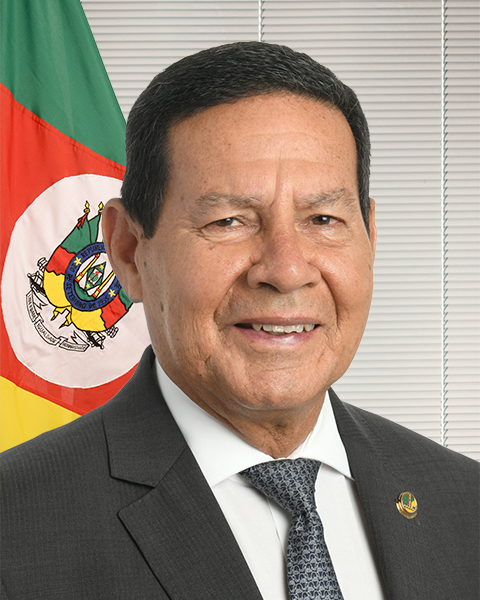

# Hamilton Mourão

<b>REPUBLICANOS</b> · senador pelo RS · titular · em exercício desde <b>01 fev 2023</b>

<h4>Não compare estes números com os dos deputados</h4>

O Senado tem outro universo: <b>117 votações abertas</b> no
período, contra 1.125 nominais da Câmara, porque
<b>67% das votações do Senado são secretas</b> — nelas a origem
confirma que o senador votou, não como.

<h4>Alinhamento com o governo federal — não calculável</h4>

O Senado não publica orientação de bancada em dados abertos, e sem
referência oficial não há contra o que comparar. Escolher uma seria rotular
por conta própria, que é o que este projeto não faz. Aqui existe um eixo só.

## Coesão com o próprio partido

| Eixo | Escopo | Valor | Base de cálculo |
|---|---|---:|---|
| Coesão com o próprio partido | Todas as votações abertas | [85,7%](evidencia/coesao-partidaria-unico/) | 105 votações computáveis117 votações no exercício |
{: .t-eixos}

Não há recorte entre mérito e procedimental aqui: a regra que separa os
dois foi calibrada contra a descrição de votação da Câmara, e não foi
validada para o texto do Senado. Sem recorte medido, não se inventa recorte.

## Por que este número

Amostra das votações em que o voto divergiu da maioria do próprio partido.
As descrições são o texto original da fonte oficial.

<blockquote class="evidencia">
12 ago 2026

Votação nominal do Art. 13 do Projeto de Lei Complementar nº 114, de 2026, destacado.

Maioria do partido: nao (0 sim / 3 não entre os pares) — voto registrado: <b>sim</b>.

<a class="fonte" href="https://legis.senado.leg.br/dadosabertos/votacao?codigoSessaoVotacao=7103">Ver votação na fonte oficial</a>

</blockquote>

<blockquote class="evidencia">
17 dez 2025

Votação nominal do Art. 7º do Projeto de Lei Complementar nº 128, de 2025, destacado.

Maioria do partido: sim (2 sim / 1 não entre os pares) — voto registrado: <b>nao</b>.

<a class="fonte" href="https://legis.senado.leg.br/dadosabertos/votacao?codigoSessaoVotacao=7043">Ver votação na fonte oficial</a>

</blockquote>

<blockquote class="evidencia">
03 dez 2025

Votação nominal da Emenda nº 1 (Substitutivo) ao Projeto de Lei Complementar nº 163, de 2025, nos termos do parecer.

Maioria do partido: sim (2 sim / 1 não entre os pares) — voto registrado: <b>nao</b>.

<a class="fonte" href="https://legis.senado.leg.br/dadosabertos/votacao?codigoSessaoVotacao=7030">Ver votação na fonte oficial</a>

</blockquote>

### A conta inteira

- [Coesão com o próprio partido, todas as votações abertas](evidencia/coesao-partidaria-unico/) — 105 votações,
  coincidências inclusive

## O que disse em plenário

São **144 discursos** coletados no período, todos substantivos.

O que aparece abaixo é o sumário publicado pelo Senado.
O texto integral não é reproduzido aqui — o link de cada discurso leva à
fonte que o publicou.

### Os 5 mais recentes

<blockquote class="evidencia discurso" id="d-6065">
15 jul 2026

Orientação à bancada

Orientação à bancada, pelo Partido REPUBLICANOS, sobre o Projeto de Lei Complementar (PLP) n° 18, de 2021, que &quot;Altera a Lei Complementar nº 141, de 13 de janeiro de 2012, para permitir que o serviço de atendimento pré-hospitalar dos corpos de bombeiros militares dos Estados e do Distrito Federal perceba emendas parlamentares destinadas às ações e serviços públicos de saúde.&quot;

<a class="fonte" href="https://www25.senado.leg.br/web/atividade/pronunciamentos/-/p/texto/523570">Ver o pronunciamento no Senado</a>

</blockquote>

<blockquote class="evidencia discurso" id="d-6064">
15 jul 2026

Orientação à bancada

Orientação à bancada, pelo Partido REPUBLICANOS, sobre o destaque para votação em separado constante do Requerimento nº 511, de 2026, (Requer, pela Liderança do Progressistas, destaque para votação em separado da Emenda nº 2 ao Projeto de Lei Complementar nº 18/2021.) ao Projeto de Lei Complementar (PLP) n° 18, de 2021, que &quot;Altera a Lei Complementar nº 141, de 13 de janeiro de 2012, para permitir que o serviço de atendimento pré-hospitalar dos corpos de bombeiros militares dos Estados e do Distrito Federal perceba emendas parlamentares destinadas às ações e serviços públicos de saúde.&quot;

<a class="fonte" href="https://www25.senado.leg.br/web/atividade/pronunciamentos/-/p/texto/523584">Ver o pronunciamento no Senado</a>

</blockquote>

<blockquote class="evidencia discurso" id="d-6063">
15 jul 2026

Pela ordem

Pela ordem sobre o Requerimento (RQS) n° 540, de 2026, que &quot;Requer urgência para o Substitutivo da Câmara dos Deputados ao Projeto de Lei nº 2.951/2024, nos termos dos arts. 336, III, e 338, III, do Regimento Interno do Senado Federal.&quot; Apelo para inclusão do requerimento em pauta.

<a class="fonte" href="https://www25.senado.leg.br/web/atividade/pronunciamentos/-/p/texto/523590">Ver o pronunciamento no Senado</a>

</blockquote>

<blockquote class="evidencia discurso" id="d-6066">
07 jul 2026

Discurso

Defesa da Lei nº 15402/2026, conhecida por Lei da Dosimetria, que permite a redução de penas relacionadas aos atos antidemocráticos de 8 de janeiro de 2023. Crítica à atuação do STF, pela suspensão da norma e por alegada demora na solução definitiva da controvérsia.

<a class="fonte" href="https://www25.senado.leg.br/web/atividade/pronunciamentos/-/p/texto/523392">Ver o pronunciamento no Senado</a>

</blockquote>

<blockquote class="evidencia discurso" id="d-6067">
30 jun 2026

Pela ordem

Pela ordem sobre o Projeto de Lei (PL) n° 2239, de 2022, que &quot;Altera a Lei nº 13.105, de 16 de março de 2015 (Código de Processo Civil), para estabelecer critérios para a concessão de gratuidade da justiça.&quot;

<a class="fonte" href="https://www25.senado.leg.br/web/atividade/pronunciamentos/-/p/texto/523152">Ver o pronunciamento no Senado</a>

</blockquote>

### Todos, por ano

| Ano | Discursos | Substantivos |
|---|---:|---:|
| [2026](discursos/2026/) | <b>19</b> | 19 |
| [2025](discursos/2025/) | <b>25</b> | 25 |
| [2024](discursos/2024/) | <b>58</b> | 58 |
| [2023](discursos/2023/) | <b>42</b> | 42 |
{: .t-anos}

